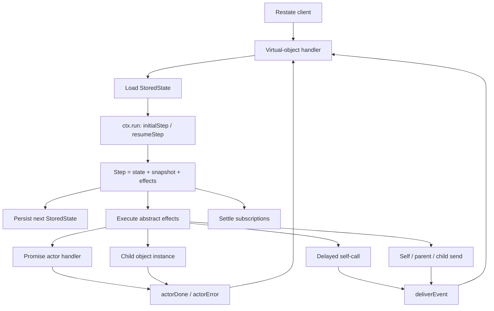
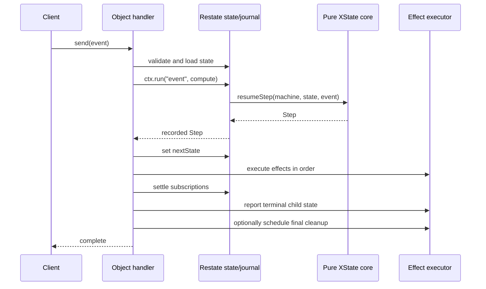

# XState + Restate Integration Manual

This manual explains how to run XState v6 machines as durable Restate virtual
objects. The first half is a user guide; the second half describes the
implementation, durability model, and testing strategy.

> [!IMPORTANT]
> This repository is currently an experiment rather than a published package.
> Its integration layer also depends on XState internals and therefore pins
> XState exactly — currently `6.0.0-alpha.21` (XState v6 is still in alpha).
> Treat an XState upgrade as an integration change that requires the full test
> suite.

## Contents

- [Part I: User guide](#part-i-user-guide)
  - [The mental model](#the-mental-model)
  - [Quick start](#quick-start)
  - [Calling a machine](#calling-a-machine)
  - [Runtime ingress contracts](#runtime-ingress-contracts)
  - [Modeling durable workflows](#modeling-durable-workflows)
  - [Promise actors and external effects](#promise-actors-and-external-effects)
  - [Delays and cancellation](#delays-and-cancellation)
  - [Waiting for progress](#waiting-for-progress)
  - [Child machines and messaging](#child-machines-and-messaging)
  - [Snapshots, creation, and disposal](#snapshots-creation-and-disposal)
  - [Supported features and limitations](#supported-features-and-limitations)
  - [Testing applications](#testing-applications)
  - [Troubleshooting](#troubleshooting)
- [Part II: Implementation guide](#part-ii-implementation-guide)
  - [Architecture](#architecture)
  - [The pure transition core](#the-pure-transition-core)
  - [Handler and commit lifecycle](#handler-and-commit-lifecycle)
  - [Persisted representation](#persisted-representation)
  - [Effect execution](#effect-execution)
  - [Promise actor execution](#promise-actor-execution)
  - [Child-machine execution](#child-machine-execution)
  - [Delayed delivery and cancellation](#delayed-delivery-and-cancellation)
  - [Waiting and subscriptions](#waiting-and-subscriptions)
  - [Replay and determinism](#replay-and-determinism)
  - [Source map](#source-map)
  - [Contributor test strategy](#contributor-test-strategy)
- [Appendix A: API reference](#appendix-a-api-reference)
- [Appendix B: Durable state keys](#appendix-b-durable-state-keys)
- [Appendix C: Error reference](#appendix-c-error-reference)

# Part I: User guide

## The mental model

`createMachineObject(name, machine)` turns an XState machine definition into a
Restate virtual object definition. Each virtual-object key identifies one
durable instance of that machine:

```text
service name: orders
object key:   order-123
instance:     one persisted execution of the order machine
```

The machine is not kept alive as an in-memory XState actor. For each call, the
integration:

1. loads a serializable machine snapshot from Restate state;
2. rehydrates it into an XState snapshot;
3. computes one XState macrostep without performing external effects;
4. persists the new snapshot; and
5. translates supported XState actions into Restate operations.

This makes the process stateless between requests while Restate owns durable
state, message delivery, retries, delays, and recovery.

## Quick start

The repository currently exposes the integration from [`src/index.ts`](src/index.ts).
The examples below therefore import from `./src`; replace that path with your
package entrypoint if you package the integration.

Define a fully typed machine. Use `fromHandler` for external work that needs the
Restate `ctx` (as below, which journals a `fetch` with `ctx.run`); use
`fromPromise` for ctx-less work (see [Promise actors](#promise-actors-and-external-effects)):

```ts
import * as restate from "@restatedev/restate-sdk";
import * as z from "zod";
import { setup, types } from "xstate";
import { createMachineObject, fromHandler } from "./src";

const OrderInputSchema = z.object({
  sku: z.string().min(1),
  quantity: z.number().int().positive(),
});

const OrderEventSchema = z.discriminatedUnion("type", [
  z.object({ type: z.literal("SUBMIT") }),
  z.object({ type: z.literal("CANCEL") }),
]);

type OrderInput = z.infer<typeof OrderInputSchema>;
type OrderEvent = z.infer<typeof OrderEventSchema>;

interface OrderContext extends OrderInput {
  reservationId?: string;
  failure?: { name: string; message: string };
}

interface ReserveInput {
  sku: string;
  quantity: number;
}

interface ReserveOutput {
  reservationId: string;
}

const reserveInventory = fromHandler<ReserveOutput, ReserveInput>(
  async ({ input, ctx }) =>
    ctx.run("reserve-inventory", async () => {
      const response = await fetch("https://inventory.example/reservations", {
        method: "POST",
        headers: { "content-type": "application/json" },
        body: JSON.stringify(input),
      });

      if (response.status === 409) {
        throw new restate.TerminalError("Inventory is unavailable");
      }
      if (!response.ok) {
        throw new Error(`Inventory service returned ${response.status}`);
      }

      return (await response.json()) as ReserveOutput;
    }),
);

export const orderMachine = setup({
  schemas: {
    input: types<OrderInput>(),
    context: types<OrderContext>(),
    events: {
      SUBMIT: types<Record<string, never>>(),
      CANCEL: types<Record<string, never>>(),
    },
  },
  actorSources: {
    reserveInventory,
  },
}).createMachine({
  id: "order-v1",
  initial: "draft",
  context: ({ input }) => ({ ...input }),
  states: {
    draft: {
      on: {
        SUBMIT: { target: "reserving" },
        CANCEL: { target: "cancelled" },
      },
    },
    reserving: {
      invoke: {
        id: "reservation",
        src: "reserveInventory",
        input: ({ context }) => ({
          sku: context.sku,
          quantity: context.quantity,
        }),
        onDone: {
          target: "confirmed",
          context: ({ output }) => ({ reservationId: output.reservationId }),
        },
        onError: {
          target: "failed",
          context: ({ event }) => ({
            failure: event.error as { name: string; message: string },
          }),
        },
      },
    },
    confirmed: {
      type: "final",
      tags: ["ready"],
    },
    cancelled: { type: "final" },
    failed: { type: "final" },
  },
});

const orders = createMachineObject("orders", orderMachine, {
  contract: {
    input: OrderInputSchema,
    event: OrderEventSchema,
  },
  journalRetention: { days: 7 },
  finalStateTTL: 30 * 24 * 60 * 60 * 1_000,
});

restate.endpoint().bind(orders).listen();
```

The integration exposes two actor factories, and vanilla XState actors
(`createAsyncLogic`, etc.) remain usable:

```ts
// Ctx-less durable effect: fail-fast, or retryable with fromPromise(fn, { retry }).
import { fromPromise } from "./src";

// Ctx-aware durable effect: the creator receives the Restate ctx.
import { fromHandler } from "./src";

// Ordinary XState promise actor: no ctx (still run durably by the runtime).
import { createAsyncLogic } from "xstate";
```

Prefer the integration's version whenever the actor performs I/O or needs
Restate's durable primitives.

The quick-start contract uses Zod 4 as an application dependency. The
integration itself does not depend on Zod; it consumes its Standard Schema
interface structurally.

To run the included example locally:

```sh
pnpm install
pnpm dev
docker run --net host --add-host=host.docker.internal:host-gateway restatedev/restate:latest
```

Then register the deployment at `http://localhost:9080` in Restate's UI at
<http://localhost:9070>. Restate ingress is available at
`http://localhost:8080` with the default local configuration.

## Calling a machine

The public handler surface is `create`, `send`, `snapshot`, `waitFor`, and the
lower-level `subscribe` handler. The URL shape through Restate ingress is:

```text
/{service-name}/{object-key}/{handler-name}
```

For the `orders` object above:

```sh
# Create or reset this object key to the machine's initial state.
curl http://localhost:8080/orders/order-123/create \
  --json '{"sku":"ABC-42","quantity":2}'

# Deliver a typed machine event.
curl http://localhost:8080/orders/order-123/send \
  --json '{"type":"SUBMIT"}'

# Read the current serializable snapshot.
curl http://localhost:8080/orders/order-123/snapshot \
  --json '{}'

# Wait at most 30 seconds for a settled snapshot carrying the ready tag.
curl http://localhost:8080/orders/order-123/waitFor \
  --json '{"condition":"hasTag:ready","timeout":30000}'
```

You can also use a generated Restate client or the TypeScript SDK client. The
exported `MachineVirtualObject<typeof machine>` type describes the handler
surface, while `EventFrom` and `InputFrom` flow from the XState machine into
`send` and `create`.

`send` completes after the event's macrostep has been computed, persisted, and
its resulting effects have been dispatched. Invoked promise actors and child
machines continue asynchronously and report their results through later events.

## Runtime ingress contracts

TypeScript types disappear at runtime, while Restate ingress, generated clients,
and other services can all supply untrusted JSON. Define the machine's public
input and event union as runtime schemas, derive the TypeScript types from those
schemas, and attach them as the machine object's `contract`:

```ts
const Input = z.object({ accountId: z.string().uuid() });
const Event = z.discriminatedUnion("type", [
  z.object({ type: z.literal("DEPOSIT"), amount: z.number().positive() }),
  z.object({ type: z.literal("CLOSE") }),
]);

type Input = z.infer<typeof Input>;
type Event = z.infer<typeof Event>;

const machine = setup({
  schemas: {
    input: types<Input>(),
  },
}).createMachine({
  // ...
});

const accounts = createMachineObject("accounts", machine, {
  contract: { input: Input, event: Event },
});
```

The integration accepts the library-neutral
[Standard Schema](https://standardschema.dev/) interface rather than importing
a validation library. Zod 4 works directly; other Standard Schema-compatible
libraries do as well. The schema output type must match XState's `InputFrom<M>`
or `EventFrom<M>`, so a mismatched contract fails type-checking.

Contracts are optional for gradual adoption, but they are recommended for every
object exposed through ingress. When present:

- `create` validates and parses machine input before reset or initialization;
- `send` validates and parses the public event before state mutation;
- the optional `waitFor.event` is parsed with the same event contract before an
  awakeable is registered; and
- validation failures are terminal status 400 errors.

### Schemas are derived from the machine by default

You rarely need to write a `contract` at all. XState v6 keeps `schemas` on the
machine at runtime, and each entry is a Standard Schema — the same interface
`contract` accepts. So if a machine already declares real validators, the object
uses them automatically:

```ts
const machine = setup({
  schemas: {
    input: z.object({ accountId: z.string().uuid() }),
    events: {
      DEPOSIT: z.object({ amount: z.coerce.number().positive() }),
      CLOSE: z.object({}),
    },
  },
}).createMachine({
  // ...
});

createMachineObject("accounts", machine); // serdes derived — no contract needed
```

Resolution is per boundary: `contract.input ?? machine.schemas.input` drives
`create`, and `contract.event` (or an adapter over `machine.schemas.events`)
drives `send` and `waitFor.event`. An explicit `contract` always wins, which is
useful when the transport shape must differ from the machine's own types.

Two rules keep this safe:

- **`types<T>()` is type-only.** Its validator accepts everything, so the
  integration treats it as "no runtime validator" and leaves that boundary
  unvalidated (exactly as before). Use a real schema library (Zod, Valibot,
  ArkType, …) to get runtime validation and coercion.
- **`schemas.events` becomes one discriminated schema.** XState stores a payload
  schema per event type, without the `type` field. The derived adapter checks
  that `type` names a declared event, validates the payload against that event's
  schema, and reattaches `type` to the (possibly coerced) result. An unknown
  event type is rejected; if every declared event is type-only, `send` stays
  permissive.

Schemas may transform input, and the machine receives the parsed output. Keep
validation synchronous: Restate handler deserialization is synchronous. Also
reserve the `xstate.*` event namespace for the integration; the public `send`
handler rejects it even when no contract is configured.

TypeBox produces JSON Schema and has its own compiled validation API. If the
TypeBox version or adapter in your application exposes Standard Schema, pass
that adapter here. Do not pass a bare JSON Schema as if it were a validator:
schema metadata alone does not prove that the value was checked at runtime.

## Modeling durable workflows

### Keep transition logic pure

Treat these parts of a machine as pure functions:

- context initializers;
- guards;
- `assign` expressions;
- event and actor-input mappers; and
- output expressions.

They should compute values, not perform network calls, write files, send email,
or mutate process-global state. Model external work as an invoked or spawned
promise actor instead.

Although the resulting `Step` is journaled for replay, pure and deterministic
transition logic remains easier to test, reason about, and migrate. Use
`ctx.date`, `ctx.rand`, or a `ctx.run` result inside a `fromHandler` actor when a
workflow decision needs time, randomness, or I/O.

### Persist only serializable data

Context, events, actor input/output, errors, and machine output cross a durable
serialization boundary. Store plain data:

- objects, arrays, strings, numbers, booleans, and `null`;
- explicit identifiers instead of live service clients;
- timestamps instead of `Date` instances; and
- plain error data instead of relying on an `Error` prototype.

Do not store functions, class instances, sockets, database handles, or arbitrary
XState actor references in context. Actor references created by supported
`spawn` patterns are reconstructed only for routing; they are not general
serializable application data.

### Make illegal states hard to express

Use discriminated event unions and narrow context types. Give every machine a
stable, explicit, unique `id`. Use explicit invoke or spawn IDs when later
actions address or stop a child.

```ts
type PaymentEvent =
  { type: "AUTHORIZE"; amount: number } | { type: "DECLINE"; reason: string };
```

The root and every reachable child machine must have a unique machine `id`.
`createMachineObject` rejects distinct machine definitions that reuse an ID,
because persisted child records resolve their logic by that ID.

### Understand macrosteps

One call applies one external event and lets XState settle the complete
macrostep. Immediate `raise` events, `always` transitions, guards, and `assign`
actions settle before the snapshot is committed. Observers see the settled
snapshot, not every transient microstate visited inside it.

## Promise actors and external effects

The integration provides two actor factories — `fromPromise` (ctx-less) and
`fromHandler` (ctx-aware) — and keeps vanilla XState `fromPromise` working
unchanged. All of them run out-of-band in the ingress-private `executeActor`
handler and report back to the machine as `onDone` / `onError`. `fromPromise`
and vanilla actors run inside `ctx.run`, so their side effect executes exactly
once and their result is journaled (replay-safe). `fromHandler` receives the
Restate `ctx` and journals its own effects.

> While an actor runs, the machine's virtual object is **locked** — no event can
> reach the machine to compensate for a failure until the actor settles. Prefer
> `fromPromise` with a `{ retry }` policy (or `fromHandler`) for anything that
> can fail transiently, rather than a fail-fast promise that gives up on the
> first error.

### `fromPromise` (ctx-less)

The creator receives only `{ input }` and runs inside `ctx.run` for exactly-once
durability. Retry is **opt-in and off by default** — a bare `fromPromise(creator)`
is fail-fast: any rejection routes to `onError` (like vanilla xstate
`fromPromise`, but durable).

```ts
import { fromPromise } from "./src";

// Fail-fast: no application-level retry.
const chargeCard = fromPromise<Receipt, ChargeInput>(async ({ input }) => {
  return charge(input);
});

// Opt into retries with { retry }: `true` uses Restate's default policy; an
// object bounds attempts/backoff. A transient rejection is then retried by
// ctx.run; a TerminalError still fails without retrying, and exhausting the
// policy routes to onError.
const chargeCardRetried = fromPromise<Receipt, ChargeInput>(
  async ({ input }) => charge(input),
  { retry: { maxRetryAttempts: 5, initialRetryInterval: 200 } },
);
```

### `fromHandler` (ctx-aware)

```ts
import { fromHandler } from "./src";

const reserve = fromHandler<Reservation, ReserveInput>(
  async ({ input, ctx }) => {
    return ctx.run("reserve", () => reserveInventory(input));
  },
);
```

The creator receives `{ input, ctx }`. It runs directly — not wrapped in
`ctx.run`, which would be illegal nested journaling — so it must journal its own
side effects with `ctx.run`, and may use Restate-native clients from `ctx` when
calling other Restate services. A `TerminalError` routes to `onError`; any other
error is rethrown so Restate retries the whole invocation under its default
policy. Follow the Restate SDK's idempotency guidance: a process can fail after
an external system accepts a request but before its result is durably recorded.

### Error behavior at a glance

| Actor kind                   | Returns  | Throws `TerminalError` | Throws another error                  |
| ---------------------------- | -------- | ---------------------- | ------------------------------------- |
| `fromPromise` (no `retry`)   | `onDone` | `onError`              | `onError` (no retry)                  |
| `fromPromise` (`{ retry }`)  | `onDone` | `onError`              | Retried by `ctx.run`; then `onError`  |
| `fromHandler`                | `onDone` | `onError`              | Rethrown; Restate retries the handler |
| Vanilla XState `fromPromise` | `onDone` | `onError`              | `onError` (no retry)                  |

Use a `TerminalError` for a permanent business or input failure that retrying
cannot fix. Throw an ordinary error for a transient operational failure only
when you passed `{ retry }` or you are in a `fromHandler`.

### Vanilla XState `fromPromise`

Ordinary XState promise actors remain supported and receive no Restate context.
They run through the XState actor lifecycle but still inside `ctx.run`, so their
result is journaled exactly-once. Any rejection is normalized to `onError` with
the original `{ name, message }` preserved; it is not retried — behaviourally the
same as a bare `fromPromise`. Because the object is locked while the actor runs,
prefer this library's `fromPromise` (so you can add `{ retry }`) or `fromHandler`
over a vanilla actor whenever the work can fail transiently; vanilla actors also
receive `{ input, signal, self, system, emit }`, but only `input` is meaningful
here — the rest are no-ops in the stateless-between-requests model.

### Concurrent actors

Multiple invokes emitted by the same transition are dispatched through a
shared internal Restate handler and may run concurrently. Each completion is
sent back through the exclusive `actorDone` or `actorError` handler. Object
exclusivity serializes those results and applies them one at a time.

Do not depend on completion order unless the state machine models that ordering
explicitly.

## Delays and cancellation

XState `after`, delayed `raise`, and delayed `sendTo` actions are translated to
Restate delayed calls. Restate owns the clock, so the Node.js process does not
need to remain alive while a timer is pending.

```ts
const machine = setup({
  // ...
}).createMachine({
  entry: ({ self }, enq) => {
    enq.sendTo(self, { type: "REMIND" }, { id: "reminder", delay: 60_000 });
  },
  on: {
    FINISH: (_, enq) => {
      enq.cancel("reminder");
    },
  },
});
```

Cancellation removes the durable token for that ID. Restate may still deliver
the already queued internal call, but the integration compares its unique token
and turns a cancelled or superseded delivery into a no-op.

Useful details:

- an explicit delay of `0` is still scheduled;
- immediate `raise` is drained inside the current macrostep;
- delayed actions without an explicit ID receive a generated unique ID; and
- use an explicit ID when you need to cancel or replace a particular delivery.

To model a recurring timer, have the delivered event schedule its next delayed
self-event. Do not use `setInterval` or a callback actor.

## Waiting for progress

`waitFor` supports two condition forms:

```ts
type Condition = "done" | `hasTag:${string}`;
```

- `done` resolves when the machine's settled snapshot has status `done`.
- `hasTag:ready` resolves when the settled snapshot has the `ready` tag.

The request can contain a timeout and an event:

```ts
await client.waitFor({
  condition: "hasTag:ready",
  event: { type: "SUBMIT" },
  timeout: 30_000,
});
```

When an event is supplied, the integration registers the subscription before
sending the event. This ordering prevents a fast transition from satisfying the
condition before the waiter exists.

Conditions are checked against settled snapshots. A tag that is entered and
left within a single macrostep may not be observable. If the machine reaches
`done` without the requested tag, that tag condition rejects. An error snapshot
rejects every pending condition.

`subscribe` is the low-level building block for integrating an existing Restate
awakeable. Most callers should use `waitFor`, which creates and awaits the
awakeable for them.

A timed-out waiter is not currently removed from the durable subscription map
immediately. Its entry is removed when the condition is later decided or the
instance is reset. Prefer bounded waits, and account for this behavior when a
condition may remain pending indefinitely.

## Child machines and messaging

An invoked or spawned state machine runs as a separate instance of the same
Restate virtual object definition. Its key is derived from the parent:

```text
parent key: order-123
child id:   payment
child key:  order-123::payment
```

Nested children extend the same pattern. The integration discovers child
machine definitions recursively from `setup({ actorSources })` and direct
`invoke.src` references.

Supported routing includes:

- `enq.sendTo(self, event)` for self-messaging;
- `enq.sendTo(children.<id>, event)` for a known child (also how `forwardTo` is
  expressed in v6);
- `enq.sendTo(parent, event)` from a child (v6's replacement for `sendParent`);
  and
- delayed `enq.sendTo(..., { delay })` for supported targets.

When an invoked child reaches `done` or `error`, it reports the appropriate
XState actor event to its parent exactly once. Exiting an invoke stops and
disposes its child instance. Re-entering it starts a fresh child under the same
derived key.

Choose child IDs as stable workflow-local identities. If two logical children
need independent lifecycles, they need distinct IDs.

## Snapshots, creation, and disposal

### Returned snapshot

The `snapshot` and `waitFor` handlers return a plain serializable projection:

```ts
interface ReturnedSnapshot {
  value: unknown;
  context: unknown;
  status: "active" | "done" | "error" | "stopped";
  output?: unknown;
  error?: unknown;
  tags: string[];
}
```

Tags are materialized as a sorted array. XState methods, live state nodes, and
actor internals are not returned.

### Creation resets an instance

Calling `create(input)` initializes the root machine at that object key. Calling
`create` again is an intentional reset: it clears runtime bookkeeping and
replaces the machine snapshot with a new initial snapshot using the new input.
It is not a read-or-create no-op.

Use reset only after coordinating or quiescing the existing execution. Reset
does not cancel the underlying promise computation or send cleanup calls to
children whose routing records it clears. Actor completion reports and delayed
deliveries from the old run are generation/token guarded and become no-ops.
Final-state cleanup scheduled by the old run is guarded the same way and cannot
dispose the replacement instance.
Application events that were already routed by an old child are not
generation-scoped, however, and external side effects already performed cannot
be undone.

Calling `send`, `snapshot`, or `waitFor` before `create` fails with status 404.

### Final-state retention

By default, a completed snapshot remains available indefinitely. Configure
`finalStateTTL` in milliseconds to dispose it after completion:

```ts
createMachineObject("orders", orderMachine, {
  finalStateTTL: 24 * 60 * 60 * 1_000,
});
```

The TTL applies when `status === "done"`, including a machine that is final on
entry. It does not currently schedule cleanup for an `error` status. After
cleanup, public handlers fail with status 410. A later explicit `create` starts
a fresh instance and clears the disposed marker.

The value must be finite and non-negative. `0` requests immediate cleanup.

## Supported features and limitations

This table describes the behavior implemented and covered by tests in this
repository, not every feature available in XState itself.

| Pattern                                            | Status                 | Notes                                                     |
| -------------------------------------------------- | ---------------------- | --------------------------------------------------------- |
| Compound and parallel states                       | Supported              | One full macrostep is persisted per event                 |
| Guards, `assign`, `always`, immediate `raise`      | Supported              | Resolved during pure transition computation               |
| Final output and tags                              | Supported              | Exposed in returned snapshots                             |
| Shallow and deep history                           | Supported              | State-node references are serialized as IDs               |
| Promise `invoke` and `spawn`                       | Supported              | `fromPromise`/`fromHandler`; all run inside `ctx.run`     |
| Concurrent promise invokes                         | Supported              | Completion order is not guaranteed                        |
| Machine `invoke` and `spawn`                       | Supported              | Each child becomes its own keyed object instance          |
| `enq.sendTo` (self / child / parent)               | Supported targets only | Self, known child, and parent routing                     |
| `after`, delayed `enq.raise`, delayed `enq.sendTo` | Supported              | Implemented with Restate delayed calls                    |
| `enq.cancel(id)`                                   | Supported              | Uses a durable delivery token                             |
| `enq.stop(ref)` / invoke exit                      | Supported              | Stopped by explicit stop or when the invoking state exits |
| `waitFor` and tags                                 | Integration feature    | Conditions are `done` and `hasTag:<tag>`                  |
| Standard Schema input/event contracts              | Integration feature    | Recommended for every public ingress boundary             |
| Repeated `create`                                  | Reset with caveat      | Stale actor results are ignored; effects are not undone   |
| Arbitrary executable XState actions (`enq(fn)`)    | **Not supported**      | Unknown/custom action effects are not executed            |
| Callback actors (`createCallbackLogic`)            | **Not supported**      | No long-lived in-process actor exists                     |
| Observable actors and other long-lived actor logic | Not guaranteed         | Only tested actor patterns should be relied upon          |
| Arbitrary actor-system addressing                  | **Not supported**      | Routing is limited to self, parent, and known children    |

The custom-action limitation is especially important. An arbitrary effect
enqueued as `enq(sendEmail)` may type-check in XState, but this integration does
not execute that custom action implementation (only the built-in `@xstate.*`
effects are interpreted). Put the operation in an invoked or spawned promise
actor so it becomes an explicit durable effect boundary.

Callback actors conflict with the stateless-between-requests architecture. For
push sources, either send events into the object from an external Restate
service or model polling/ticking as recurring delayed self-events.

## Testing applications

The design deliberately exposes a pure core and a thin Restate adapter. Use
both layers in application tests.

### 1. Test machine decisions as pure logic

Use XState's pure transition APIs or the integration's `initialStep` and
`resumeStep` functions internally to cover:

- every event/state decision table;
- guards and context updates;
- final output;
- emitted abstract effects; and
- snapshot JSON round-trips.

Pure tests should make up most of the suite because they are fast and isolate
modeling mistakes precisely.

### 2. Unit-test effect functions

Move business I/O behind small typed functions. Test the decision-free
function separately, then test the actor with a minimal fake context where
practical. At minimum, cover:

- success and output mapping;
- transient failure;
- `TerminalError` and `onError`;
- request idempotency behavior; and
- malformed responses from external dependencies.

### 3. Run the complete machine against Restate

The repository's E2E harness starts a real Restate testcontainer and creates a
typed object client. Each E2E suite runs twice:

- normal execution; and
- `alwaysReplay`, which forces replay at suspension points and exposes
  nondeterminism or incorrect journal use.

A representative test looks like:

```ts
import { expect, it } from "vitest";
import { describeE2E } from "./harness";

describeE2E("order workflow", (createActor) => {
  it("reserves and completes", async () => {
    using order = await createActor({
      machine: orderMachine,
      key: "order-123",
      input: { sku: "ABC-42", quantity: 2 },
    });

    await order.send({ type: "SUBMIT" });

    await expect(order.waitFor("done")).resolves.toMatchObject({
      status: "done",
      value: "confirmed",
    });
  });
});
```

Include E2E cases for the boundaries pure tests cannot prove:

- retry and terminal-error behavior;
- process/replay safety;
- concurrent actor completion;
- delayed delivery and cancellation;
- parent/child messaging and child re-entry;
- waiter registration races and timeouts;
- repeated `create`; and
- final-state cleanup.

### Repository commands

```sh
# Fast pure/unit suite; no Docker required.
pnpm test:unit

# Type-check production and test code, lint, format-check, then unit tests.
pnpm check

# Full Vitest suite, including Restate testcontainers. Requires Docker.
pnpm test

# Only the e2e suite (Restate testcontainers). Requires Docker.
pnpm test:e2e

# Complete pre-merge validation.
pnpm verify
```

When fixing a bug, first add the smallest pure regression test that reproduces
it. Add an E2E regression when the defect involves Restate state, replay,
concurrency, timers, awakeables, retries, or object-to-object delivery.

## Troubleshooting

### The machine never leaves an invoke state

Check which factory was used, whether the promise resolves, and whether its
`onDone`/`onError` transitions exist. An ordinary error is retried (rather than
sent to `onError`) for a `fromPromise` with `{ retry }` or a `fromHandler`; a
`fromPromise` without `{ retry }` and vanilla actors instead route any error to
`onError`.

### A named action did nothing

Arbitrary executable XState actions are not an effect mechanism in this
integration. Convert the action to an invoked/spawned promise actor, a supported
send, or a supported delayed event.

### A waiter missed a state

Waiters observe settled macrosteps. Attach a persistent tag to the stable state
that clients should observe. Do not depend on a tag that is entered and left by
immediate transitions in one macrostep.

### A cancelled delayed call still appears in Restate

This is expected. Cancellation invalidates the integration's durable token; it
does not remove Restate's already queued internal call. Delivery checks the
token and exits without sending the event.

### A child machine cannot be resolved

Give every machine a unique explicit `id`, and make the child reachable through
`setup({ actorSources })` or a direct `invoke.src` machine reference. Duplicate IDs
are rejected when the object definition is created.

### Behavior changed after upgrading XState

Restore the pinned version, then inspect action shapes and inert actor-scope
behavior before attempting the upgrade again. Run unit probes and the complete
normal/`alwaysReplay` E2E suite. See [Replay and determinism](#replay-and-determinism).

# Part II: Implementation guide

## Architecture

The integration has a pure XState-facing core and an effectful Restate-facing
shell:



The dependency direction is intentional:

```text
src/xstate/*   knows XState and plain TypeScript data
src/restate/*  executes xstate effects using Restate
```

`src/xstate/interpret.ts` has no Restate import. It can be tested with ordinary
objects and machine definitions. `src/restate/effects.ts` does not decide state
transitions; it executes a closed `Effect` union.

## The pure transition core

The two entrypoints are:

```ts
initialStep(machine, { input, isChild }): Step

resumeStep(machine, {
  stored,
  event,
  isChild,
  knownChildIds,
  knownPromiseIds,
}): Step
```

Both return:

```ts
interface Step {
  nextState: StoredState;
  returned: ReturnedSnapshot;
  effects: Effect[];
}
```

The interpreter uses an inert XState actor scope to run the initial transition
or one macrostep. XState resolves guards, `assign`, `always`, and immediate
raises. The integration inspects the remaining executable XState actions and
maps recognized internal action types to its own discriminated `Effect` union:

```ts
type Effect =
  | { kind: "runPromise"; params: SpawnParams }
  | {
      kind: "startChild";
      childId: string;
      machineId: string;
      input: unknown;
    }
  | { kind: "stopChild"; childId: string }
  | { kind: "stopPromise"; actorId: string }
  | { kind: "send"; target: Target; event: AnyEventObject }
  | {
      kind: "scheduleSend";
      sendId?: string;
      target: Target;
      event: AnyEventObject;
      delay: number;
    }
  | { kind: "cancel"; sendId: string };
```

This is the central separation of pure logic from effects. Adding a new effect
requires an explicit type, interpreter mapping, Restate executor branch, and
tests at both boundaries.

XState drops live actor references when a snapshot is reconstructed. Before a
transition, the core reinjects inert stubs for known persisted child and promise
actor IDs. This prevents active actors from being restarted and lets `sendTo`
and `forwardTo` resolve child targets without trying to revive an in-memory
actor.

## Handler and commit lifecycle

`createMachineObject` builds a registry of the root and reachable child
machines, validates options, and returns a Restate virtual object.

The main event lifecycle is:



`create` follows the same path using `initialStep`, after clearing runtime and
root/child identity metadata. `initChild` is the internal equivalent: it clears
runtime state, stores the child's machine ID and parent identity, then computes
that child machine's initial step.

The commit order is significant:

1. store the next snapshot;
2. execute effects in their emitted order;
3. settle waiters from the returned snapshot;
4. report terminal child status to the parent; and
5. schedule final-state cleanup if configured.

Object exclusivity serializes state mutation. Promise actors execute through a
shared ingress-private handler with lazy state enabled, allowing independent
invokes to overlap without giving them mutation access.

The public and internal protocols are intentionally separate:

- `send` accepts only public machine events, applies the configured contract,
  and rejects the reserved `xstate.*` namespace;
- `deliverEvent` carries domain events produced by supported machine messaging
  effects without exposing them through public ingress; and
- `actorDone` and `actorError` carry the two finite actor result variants,
  including the execution ID needed for stale-result rejection.

Only `actorDone` and `actorError` construct XState lifecycle events. No generic
handler accepts a union of public domain events and actor-system result events.

## Persisted representation

Raw XState snapshots are not persisted. They contain methods, actor data, sets,
and live `StateNode` references. The integration stores only:

```ts
interface StoredState {
  value: unknown;
  context: unknown;
  status: SnapshotStatus;
  output?: unknown;
  error?: unknown;
  historyValue: Record<string, string[]>;
}
```

History is the non-obvious part. XState represents history using live state-node
objects. `toStored` converts each node to its stable state-node ID;
`fromStored` looks those IDs up through `machine.getStateNodeById` before calling
`machine.resolveState`. This preserves shallow and deep history through JSON
serialization and process loss.

`ReturnedSnapshot` is a separate boundary type. It adds sorted tags but omits
internal history and live XState structures.

## Effect execution

`executeEffects` loads the scheduled-delivery, child-routing, and active actor
generation maps once, walks the effect array in order, performs Restate
operations, and writes changed maps back. The exhaustive `switch` ends in an
`assertNever`, so TypeScript makes an unhandled new effect kind a compile-time
error.

Effects are deliberately descriptions, not closures. This keeps them
serializable and makes unit tests simple: a test can assert an exact effect
array without mocking Restate.

Target resolution is also data-driven:

```ts
type Target =
  { type: "self" } | { type: "child"; childId: string } | { type: "parent" };
```

The effectful layer resolves this target to a Restate object key from the
current handler identity and durable child map. A target that no longer exists
is dropped rather than sent to the wrong object.

## Promise actor execution

`fromPromise` and `fromHandler` return real XState promise actor logic so that
XState emits its normal spawn action. They also attach a tag (a `restate.actor`
sentinel plus a `kind` discriminant and the real creator) that lives in the
Restate layer, not the pure core. The placeholder XState promise must never be
started in the inert transition scope.

The pure layer emits `runPromise`, and the Restate layer dispatches the
ingress-private `executeActor` handler. `runActor` resolves named actor sources
from machine implementations, then dispatches by kind — one runner per kind:

- `promise`: a ctx-less `fromPromise`. Without a `retry` policy it shares a
  `runOnce` wrapper with vanilla actors — the body runs once inside `ctx.run` and
  a rejection is captured as the run's result (not rethrown), so `ctx.run` never
  retries an application error, while a genuine infrastructure crash is still
  retried. (Vanilla actors reach `runOnce` the same way, differing only in the
  body: they go through XState `createActor`/`toPromise`, whereas a `fromPromise`
  calls its creator directly.) With a `retry` policy the body instead runs inside
  `ctx.run` under that `RetryPolicy`: a non-terminal rejection is retried; a
  `TerminalError` or an exhausted policy fails terminally.
- `handler`: run the creator directly with `{ input, ctx }` (no `ctx.run`
  wrapper — that would be illegal nested journaling); convert `TerminalError` to
  an error outcome and rethrow anything else so Restate retries the invocation.

All paths normalize errors to plain `{ name, message }` data before that error is
persisted or crosses an object boundary. Because every actor result is journaled
by `ctx.run` (except `handler`, which owns `ctx` and journals its own work), a
side effect executes exactly once and is replay-safe.

Every promise start gets a durable random execution ID. The shared actor handler
returns its result to the same keyed object through one of two explicit,
ingress-private protocols:

```text
actorDone({ actorId, executionId, output })
actorError({ actorId, executionId, error })
```

The exclusive result handler consumes the ID only when it matches the current
generation, then constructs the corresponding XState lifecycle event inside the
integration. A result from a stopped, reset, or re-entered actor is stale and is
ignored. Public callers cannot inject these lifecycle events through `send`.

## Child-machine execution

At object-definition time, `buildRegistry` recursively visits:

- the root machine;
- machines in each machine's `implementations.actorSources`; and
- machine objects referenced directly by `invoke.src`.

It indexes them by machine ID and rejects ambiguous duplicate IDs.

Starting a machine child:

1. derives `${parentKey}::${childId}`;
2. generates and records a new execution ID for the child ID;
3. records `{ key, machineId }` in the parent's child map;
4. sends `initChild` with that execution ID to the derived object key; and
5. records the child's `parentKey`, `invokeId`, and execution ID with its own
   state.

Updating the effect executor's working child map before later effects is
important: a subsequent effect in the same step can already route a message to
that child. The changed routing and generation maps are written to Restate state
before the handler completes.

On a terminal child snapshot, `reportTerminal` calls the parent's `actorDone` or
`actorError` handler with the child's execution ID. A durable `reported` flag
prevents duplicate terminal reports; the parent generation check rejects a late
report from a replaced child. Stopping a child removes its parent record and
sends the child an internal cleanup call.

## Delayed delivery and cancellation

A delayed send cannot be physically withdrawn from Restate's queue. The
integration therefore uses logical cancellation:

```text
scheduled[sendId] = { uuid, targetKey, event }
```

It schedules an internal `deliverScheduled({ sendId, uuid })` call. On delivery,
the handler reloads the record and proceeds only if both IDs still match. It
deletes the record before routing the event.

`cancel(sendId)` deletes the record. Scheduling a new event under the same
explicit ID replaces its UUID, making older deliveries stale. For unnamed
delayed sends, `ctx.rand.uuidv4()` supplies both a collision-free key and a
delivery token.

This pattern makes cancellation deterministic without requiring an unsupported
queue-removal primitive.

## Waiting and subscriptions

`waitFor` is a shared handler so it can remain suspended without blocking the
object's exclusive event handlers. It:

1. validates the object, condition, and optional public event contract;
2. creates a Restate awakeable;
3. calls the exclusive `subscribe` handler to evaluate or store it;
4. optionally routes the parsed request event through `deliverEvent`; and
5. awaits the result, optionally with a timeout.

`subscribe` first checks the current snapshot. It immediately resolves a
satisfied condition or rejects one that can no longer succeed. Otherwise it
stores the awakeable ID under the condition.

Every committed step calls `settleSubscriptions`. It evaluates each distinct
condition once, settles all awakeables registered for a decided condition, and
removes that condition from durable state.

An awakeable rejection arrives as a Restate error with code 500. `waitFor`
translates that specific case to terminal status 412 so callers can distinguish
a condition that became impossible from a transient service failure.

The current timeout path does not unregister its awakeable ID from the
subscription map. A later decided snapshot removes the condition and attempts
to settle every registered ID; reset also clears the map. This is an area to
revisit if applications create many timeouts against conditions that can remain
pending forever.

## Replay and determinism

Restate may replay a handler after suspension or recovery. The integration
wraps transition computation in:

```ts
ctx.run("create", () => initialStep(...));
ctx.run("event", () => resumeStep(...));
```

The journal records the resulting `Step`, so replay uses the recorded value
instead of rerunning synchronous machine code for that journal entry. Restate
also journals state operations, sends, random UUID generation, awakeables, and
delays.

This is a safety boundary, not a reason to hide effects inside guards or
assignments. Keeping machine evaluation pure avoids surprising behavior during
fresh execution, test probes, migrations, and version upgrades.

The parent-aware inert XState scope and action decoding currently depend on
XState internal shapes. In particular, the integration recognizes XState's
internal action type strings and fabricates inert actor references for routing.
That is why XState is pinned exactly to `5.32.4`.

For an XState upgrade:

1. inspect emitted action types and parameter shapes;
2. verify initial and transition scope behavior;
3. verify invoke/spawn behavior, including spawn inside `assign`;
4. verify actor-ref routing after snapshot rehydration;
5. run snapshot/history round-trip probes;
6. run all unit tests; and
7. run the E2E suite in both normal and forced-replay modes.

## Source map

| Module                                                 | Responsibility                                                               |
| ------------------------------------------------------ | ---------------------------------------------------------------------------- |
| [`src/index.ts`](src/index.ts)                         | Public exports                                                               |
| [`src/xstate/types.ts`](src/xstate/types.ts)           | Persisted, returned, step, target, and effect types                          |
| [`src/xstate/interpret.ts`](src/xstate/interpret.ts)   | Pure initial/resume steps and XState-action translation                      |
| [`src/xstate/scope.ts`](src/xstate/scope.ts)           | Inert and parent-aware XState execution scope                                |
| [`src/xstate/snapshot.ts`](src/xstate/snapshot.ts)     | Snapshot serialization, history rehydration, public projection               |
| [`src/xstate/registry.ts`](src/xstate/registry.ts)     | Reachable child-machine discovery and ID validation                          |
| [`src/xstate/conditions.ts`](src/xstate/conditions.ts) | Pure waiter-condition validation and evaluation                              |
| [`src/xstate/actors.ts`](src/xstate/actors.ts)         | Actor-source resolution and error/event helpers (pure)                       |
| [`src/restate/contracts.ts`](src/restate/contracts.ts) | Pure runtime-contract parsing and public-event classification                |
| [`src/restate/object.ts`](src/restate/object.ts)       | Virtual-object composition, handler/runtime classes, and transition pipeline |
| [`src/restate/effects.ts`](src/restate/effects.ts)     | Abstract-effect execution, waiter settlement, terminal reporting             |
| [`src/restate/state.ts`](src/restate/state.ts)         | Named accessors for all durable KV state                                     |
| [`src/restate/promise.ts`](src/restate/promise.ts)     | `fromPromise`/`fromHandler` factories, the actor tag, and `isRestateActor`   |
| [`src/restate/run-actor.ts`](src/restate/run-actor.ts) | Per-kind out-of-band actor execution and error/retry semantics               |
| [`src/restate/types.ts`](src/restate/types.ts)         | Restate handler, request, option, and child-record types                     |

## Contributor test strategy

The repository uses four confidence layers:

1. **Pure behavior tests** cover snapshots, conditions, registry discovery,
   action translation, routing, and exact `Step`/`Effect` values.
2. **Adapter unit tests** use narrow fake contexts to cover state-independent
   Restate dispatch, cancellation tokens, child maps, actor errors, and terminal
   reporting.
3. **E2E tests** run real virtual objects against Restate testcontainers.
4. **Forced-replay E2E tests** repeat every E2E scenario with
   `alwaysReplay: true`.

When implementing a feature, keep the same dependency direction:

- add or refine a discriminated pure type;
- compute it without Restate dependencies;
- execute it in the Restate shell;
- exhaustively handle the new union member;
- test the pure decision table;
- test the adapter call/state changes; and
- add E2E coverage for the durable behavior.

High-value invariants to preserve include:

- JSON round-trip does not change future transitions;
- deep history survives persistence;
- two unnamed delayed sends cannot collide;
- cancellation makes stale deliveries harmless;
- invalid runtime contracts fail before state mutation;
- public callers cannot forge `xstate.*` lifecycle events;
- stale promise/child generations cannot complete a replacement actor;
- child start/stop/re-entry does not retain old state;
- a child terminal event is reported once;
- concurrent invokes cannot overwrite each other's context updates;
- subscription is established before an optional triggering event;
- a `fromPromise` with `{ retry }` and `fromHandler` actor errors retry, while a
  `fromPromise` without `{ retry }` and vanilla actor errors reach `onError`;
  terminal errors always reach `onError`;
  and
- every durable scenario behaves the same under forced replay.

# Appendix A: API reference

## Exports

| Export                 | Kind     | Purpose                                                                 |
| ---------------------- | -------- | ----------------------------------------------------------------------- |
| `createMachineObject`  | Function | Convert a root XState machine into a Restate object definition          |
| `fromPromise`          | Function | Ctx-less durable promise actor; fail-fast, or retryable via `{ retry }` |
| `fromHandler`          | Function | Ctx-aware durable actor; creator receives `{ input, ctx }`              |
| `PromiseCreator`       | Type     | `fromPromise` creator signature receiving `{ input }`                   |
| `HandlerCreator`       | Type     | `fromHandler` creator signature receiving `{ input, ctx }`              |
| `FromPromiseOptions`   | Type     | `fromPromise` options (`retry?: boolean \| RetryPolicy`)                |
| `RetryPolicy`          | Type     | `ctx.run` retry tuning (attempts, intervals, backoff)                   |
| `MachineObjectOptions` | Type     | Restate options plus runtime contract and `finalStateTTL`               |
| `MachineContract`      | Type     | Optional Standard Schema input/event contracts                          |
| `StandardSchema`       | Type     | Library-neutral runtime-schema interface                                |
| `MachineVirtualObject` | Type     | Typed handler surface for SDK clients                                   |
| `WaitForRequest`       | Type     | Condition, optional timeout, and optional typed event                   |
| `SubscribeRequest`     | Type     | Condition plus an existing awakeable ID                                 |
| `StoredState`          | Type     | Internal serializable snapshot representation                           |
| `ReturnedSnapshot`     | Type     | Public serializable snapshot projection                                 |
| `Condition`            | Type     | `done` or `hasTag:<tag>`                                                |

## Public handlers

| Handler     | Request             | Result             | Notes                                             |
| ----------- | ------------------- | ------------------ | ------------------------------------------------- |
| `create`    | `InputFrom<M>`      | `void`             | Creates or resets the root instance               |
| `send`      | `EventFrom<M>`      | `void`             | Commits one settled macrostep                     |
| `snapshot`  | `{}`                | `ReturnedSnapshot` | Requires an existing, non-disposed instance       |
| `waitFor`   | `WaitForRequest<M>` | `ReturnedSnapshot` | Shared long-poll; event is sent after subscribing |
| `subscribe` | `SubscribeRequest`  | `void`             | Low-level awakeable registration                  |

The object also contains ingress-private handlers named `deliverEvent`,
`actorDone`, `actorError`, `executeActor`, `deliverScheduled`, `initChild`,
`cleanupState`, and `cleanupFinalState`. `deliverEvent` carries internally routed
domain events;
`actorDone` and `actorError` are the finite actor lifecycle protocols. They are
implementation details and should not be called by application clients.

# Appendix B: Durable state keys

All KV access is centralized in [`src/restate/state.ts`](src/restate/state.ts).

| Key               | Value                           | Purpose                                                       |
| ----------------- | ------------------------------- | ------------------------------------------------------------- |
| `state`           | `StoredState`                   | Current serialized XState snapshot                            |
| `disposed`        | `boolean`                       | Marks an instance cleaned after final-state TTL or child stop |
| `subscriptions`   | condition → awakeable IDs       | Pending `waitFor`/`subscribe` registrations                   |
| `scheduled`       | send ID → delivery record       | Cancellation and stale-delivery guard                         |
| `children`        | child ID → `{ key, machineId }` | Durable child routing and lifecycle                           |
| `actorExecutions` | actor ID → execution ID         | Rejects stale promise and child completion reports            |
| `cleanupToken`    | cleanup execution ID            | Rejects final-state cleanup from an older instance            |
| `reported`        | `boolean`                       | Prevents duplicate terminal reports from a child              |
| `machineId`       | `string`                        | Selects child machine logic from the registry                 |
| `parentKey`       | `string`                        | Routes `enq.sendTo(parent, …)` and terminal reports           |
| `invokeId`        | `string`                        | Builds the parent's XState actor result event                 |
| `executionId`     | `string`                        | Identifies the current generation of a child instance         |

# Appendix C: Error reference

| Status/code | Meaning                                                | Typical fix                                                           |
| ----------- | ------------------------------------------------------ | --------------------------------------------------------------------- |
| 400         | Invalid contract value, event, or wait condition       | Fix the payload; use `done` or `hasTag:<tag>`                         |
| 404         | No machine at this object key                          | Call `create` before `send`, `snapshot`, or `waitFor`                 |
| 410         | Instance was disposed                                  | Use a new key or explicitly call `create` to start fresh              |
| 412         | Wait condition became impossible                       | Handle completed/error outcome instead of retrying the same condition |
| 500         | Unknown persisted child machine ID or internal failure | Check unique stable machine IDs and deployment compatibility          |

Configuration errors such as a negative, infinite, or `NaN`
`finalStateTTL` throw synchronously while creating the object definition.
